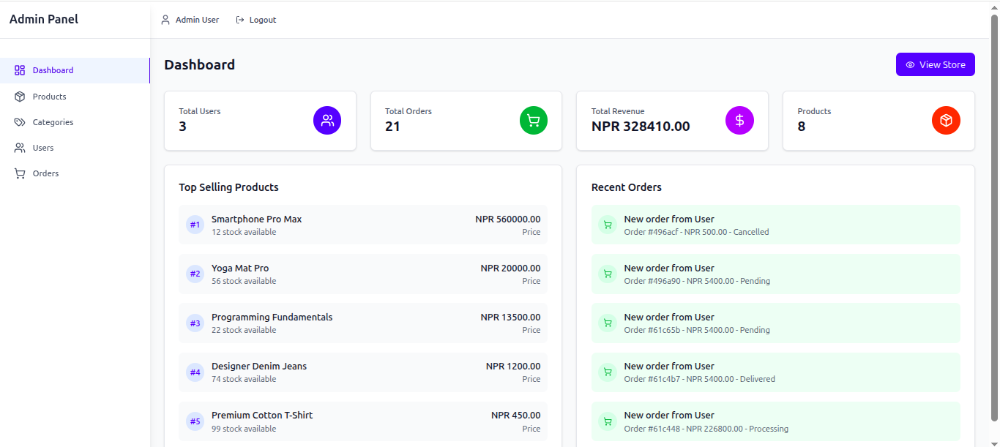

# 🛒 MERN E-Commerce Application

A full-featured, production-ready e-commerce web application built with the MERN stack (MongoDB, Express.js, React.js, Node.js). This application provides a complete shopping experience with user authentication, product management, shopping cart functionality, and order processing.


## ✨ Features

### 👤 User Features

- **Authentication**: Secure user registration and login with JWT
- **Product Browsing**: View products with advanced search, filters, and categories
- **Shopping Cart**: Add, remove, and update product quantities
- **Checkout Process**: Complete order placement with shipping details
- **Order History**: View past orders and track order status
- **Responsive Design**: Optimized for desktop, tablet, and mobile devices

### 🔐 Admin Features

- **Admin Dashboard**: Comprehensive analytics and management interface
- **Product Management**: Full CRUD operations for products
- **Order Management**: View and update order statuses
- **Category Management**: View, Add and update categories
- **User Management**: View registered users and their details
- **Analytics**: Sales reports, top products, and revenue tracking

## 🛠 Tech Stack

### Frontend

- **React.js** - UI library for building user interfaces
- **Redux Toolkit** - State management
- **React Router** - Client-side routing
- **Tailwind CSS** - Utility-first CSS framework
- **Axios** - HTTP client for API requests
- **React Hot Toast** - Toast notifications
- **Lucide React** - Beautiful icons

### Backend

- **Node.js** - JavaScript runtime
- **Express.js** - Web application framework
- **MongoDB** - Database (for local development)
- **JWT** - JSON Web Tokens for authentication
- **bcryptjs** - Password hashing
- **Helmet** - Security middleware
- **CORS** - Cross-origin resource sharing

## 📁 Project Structure (NOT FULL)

```
mern-ecommerce-app/
├── client/                # React frontend (src/)
│   ├── package.json       # Dependencies and scripts
│   ├── components/        # Reusable UI components
│   │   ├── Layout/        # Header, Footer, Layout components
│   │   └── Products/      # Product-related components
│   ├── pages/             # Page components
│   │   ├── Auth/          # Login, Register pages
│   │   └── ...            # Other pages
│   ├── store/             # Redux store and slices
│   └── utils/             # Utility functions and API setup
├── server/                # Node.js backend
│   ├── models/            # Database configuration
│   ├── middleware/        # Authentication and other middleware
│   ├── routes/            # API routes
│   ├── package.json       # Dependencies and scripts
│   └── seeders/           # Database seeding scripts
├── images/                # Screeenshot of UI
└── README.md              # Project documentation
```

## 🚀 Getting Started

### Prerequisites

- Node.js (v16 or higher)
- npm or yarn package manager

### Installation

1. **Clone the repository**

   ```bash
   git clone <repository-url>
   cd <folders-name>
   ```

2. **Install dependencies**

   ```bash
   npm install
   ```

3. **Environment Setup**

   ```bash
   cp .env.example .env
   ```

   Update the `.env` file with your configuration for client and server:

   ```env
   PORT=5000
   MONGODB_URI=mongodb://localhost:27017/ecommerce
   CLIENT_URL=http://localhost:3000
   NODE_ENV=development
   JWT_SECRET=your-super-secret-jwt-key-change-this-in-production
   KHALTI_TEST_SECRET_KEY=your-khalti-live-secret-key
   ```

   ```env
   VITE_API_URL: 'http://localhost:5000/api'
   ```

4. **Start the server**

   ```bash
   nodemon index.js
   ```

5. **Start the application**
   ```bash
   npm run dev
   ```

The application will be available at:

- **Frontend**: http://localhost:3000
- **Backend API**: http://localhost:5000

## 🔧 Available Scripts

- `npm run dev` - Start frontend in development mode
- `npm run client` - Start only the frontend development server
- `nodemon index.js` - Start only the backend server
- `npm run build` - Build the frontend for production
- `npm run seed` - Seed the database with sample data

## 🖥️ Frontend Details

### State Management

The application uses Redux Toolkit for state management with the following slices:

- **authSlice**: User authentication and profile management
- **productSlice**: Product catalog and filtering
- **cartSlice**: Shopping cart functionality
- **orderSlice**: My order page functionality for orders
- **ordersSlice**: Order management for Admin
- **usersSlice**: Get user Update User
- **categoriesSlice**: Get, Update, Create, Delete Categories
- **adminSlice**: Management of Admin

### API Integration

- Centralized API configuration using Axios
- Automatic token attachment for authenticated requests
- Global error handling and toast notifications
- Request/response interceptors for enhanced UX

### Responsive Design

- Mobile-first approach using Tailwind CSS
- Breakpoints: Mobile (<768px), Tablet (768-1024px), Desktop (>1024px)
- Optimized layouts for all screen sizes

## ⚙️ Backend Details

### Database Schema

The application uses MongoDB for local development with the following main tables inside models:

- **users**: User accounts and profiles
- **categories**: Product categories
- **products**: Product catalog
- **orders**: Customer orders
- **order_items**: Individual order items
- **cart_items**: Shopping cart contents

### API Endpoints

#### Authentication

- `POST /api/auth/register` - User registration
- `POST /api/auth/login` - User login
- `GET /api/auth/me` - Get current user

#### Products

- `GET /api/products` - Get products with filtering and pagination
- `GET /api/products/:id` - Get single product
- `GET /api/products/categories/all` - Get all categories

#### Cart & Orders

- `GET /api/users/cart` - Get user's cart
- `POST /api/users/cart` - Add item to cart
- `PUT /api/users/cart/:productId` - Update cart item
- `DELETE /api/users/cart/:productId` - Remove from cart
- `POST /api/orders` - Create new order
- `GET /api/orders` - Get user's orders
- `More`

#### Admin (Protected)

- `GET /api/admin/stats` - Dashboard statistics
- `GET /api/admin/products` - Manage products
- `POST /api/admin/products` - Create product
- `PUT /api/admin/products/:id` - Update product
- `DELETE /api/admin/products/:id` - Delete product
- `More`

### Security Features

- JWT-based authentication
- Password hashing with bcryptjs
- Rate limiting to prevent abuse
- CORS configuration
- Helmet for security headers
- Input validation and sanitization

### Payment Integration

- Khalti Wallet Checkout
- Cash on Delivery

## 💾 Database Seeding

The application includes a comprehensive seeding script that populates the database with:

- **Sample Categories**: Electronics, Clothing, Home & Garden, Sports, Books
- **Sample Products**: 8 featured products with images and descriptions
- **Admin User**: Email: `admin@gmail.com`, Password: `admin123`
- **Test User**: Email: `user@gmail.com`, Password: `user123`

Run the seeder with:

```bash
npm run seed
```

## 🌐 Deployment Guide (NOTE: NOT YET DEPLOYED)

### Frontend Deployment (Vercel)

1. Build the project: `npm run build`
2. Deploy the `dist` folder to Vercel
3. Set environment variables in Vercel dashboard

### Backend Deployment (Railway/Render)

1. Create a new service on Railway or Render
2. Connect your GitHub repository
3. Set environment variables:
   - `NODE_ENV=production`
   - `JWT_SECRET=your-production-secret`
   - `CLIENT_URL=your-frontend-url`
4. The service will automatically deploy

## 🧪 Testing

### Manual Testing Checklist

- [ ] User registration and login
- [ ] Product browsing and filtering
- [ ] Add/remove items from cart
- [ ] Checkout process
- [ ] Order placement and history
- [ ] Admin dashboard functionality

### API Testing

Use tools like Postman or Insomnia to test API endpoints:

```bash
# Example: Get products
GET http://localhost:5000/api/products

# Example: Login
POST http://localhost:5000/api/auth/login
Content-Type: application/json

{
  "email": "user@example.com",
  "password": "user123"
}
```

## 🧹 Troubleshooting

### Common Issues

**Port already in use**

```bash
# Kill process on port 5000
npx kill-port 5000
```

**Database connection issues**

- Ensure the database file has proper permissions
- Check if the database directory exists
- Verify environment variables are set correctly

**CORS errors**

- Ensure `CLIENT_URL` in `.env` matches your frontend URL
- Check CORS configuration in `server/index.js`

**Authentication issues**

- Verify JWT secret is set in environment variables
- Check token expiration settings
- Ensure proper token storage in localStorage

### Performance Optimization

- Enable gzip compression in production
- Implement image optimization and lazy loading
- Use Redis for session storage in production
- Add database indexing for frequently queried fields

## 📸 Screenshots

### Homepage


### Product Page


### Order Page


### Login Page


### Register Page


### Admin Panel



### Orders Management


### Product Management


## 📜 License

This project is licensed under the MIT License - see the [LICENSE](LICENSE) file for details.

## 🤝 Contributing

1. Fork the repository
2. Create a feature branch (`git checkout -b feature/AmazingFeature`)
3. Commit your changes (`git commit -m 'Add some AmazingFeature'`)
4. Push to the branch (`git push origin feature/AmazingFeature`)
5. Open a Pull Request

## 📞 Support

For support and questions:

- Create an issue in the GitHub repository
- Email: luitelsaurav627@gmail.com
- Documentation: [Project Wiki](link-to-wiki)

## 🙏 Acknowledgments

- [Pexels](https://pexels.com) for providing high-quality stock images
- [Lucide](https://lucide.dev) for beautiful icons
- [Tailwind CSS](https://tailwindcss.com) for the utility-first CSS framework
- The open-source community for amazing tools and libraries

---

**Built with ❤️ by Saurav**

_This is a demonstration project showcasing modern web development practices with the MERN stack._
